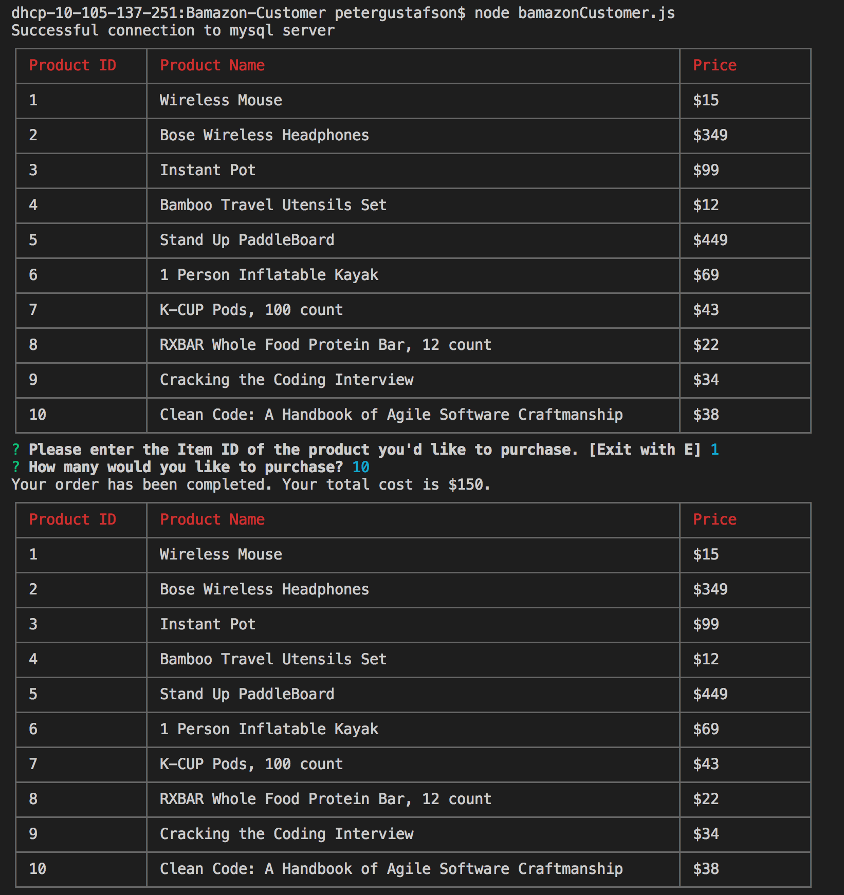

# bamazon

Link to GitHub repository: https://peterlgustafson.github.io/bamazon/

About: Bamazon is an Amazon-like storefront that takes in product orders from customers and depletes stock from the store's inventory.

Video Demo: https://drive.google.com/file/d/1qOPVPT_22JLUYVJifvELvoFbAOLTPacd/view

The App: 

Description: This is a simple Node.JS powered application that renders a table of products (with Item ID, Product Name & Price) and then allows the user to choose a product and quantity to purchase. 

- If the user chooses to purchase, their order will be completed and they will be shown their total cost. 
- On the back-end, the quantity the user purchases will be subtracted from the database.  
- If the user selects a quantity to purchase that exceeds the quantity in stock they will get an error message and their order will not be completed. 

Technologies Used: Node.JS, mySQL, mySQL NPM Package, Inquirer NPM Package & CLI-Table NPM Package.
